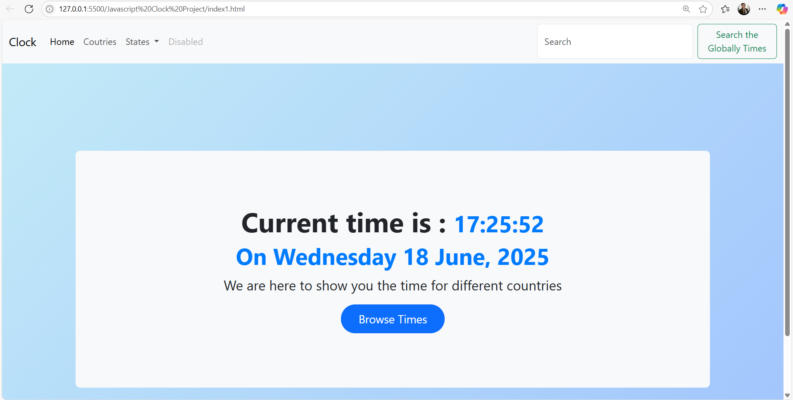

# 🕒 Digital Clock using HTML, CSS & JavaScript

This project is a beautifully designed **digital clock** that displays the current time and date in real-time using **vanilla JavaScript**, styled with custom CSS.

---

## 🔥 Features

- ✅ Real-time clock with live updates
- ✅ Displays formatted date (weekday, day, month, year)
- ✅ Clean, modern, and responsive UI
- ✅ Built with Bootstrap 5 & custom CSS
- ✅ Works in all modern browsers

---

## 📸 Preview

---

## 🛠️ Technologies Used

- HTML5
- CSS3
- JavaScript (vanilla)
